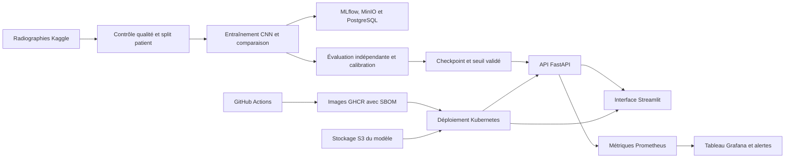

# Architecture finale

Le pipeline de données sépare les patients avant l'entraînement afin de limiter les
fuites entre apprentissage, validation et test. Le seuil de décision est choisi sur
la validation, puis figé avant l'évaluation finale.

Les images Docker ne contiennent ni données médicales ni modèle. En production,
un conteneur d'initialisation Kubernetes récupère le checkpoint et son seuil depuis
un stockage objet protégé.
